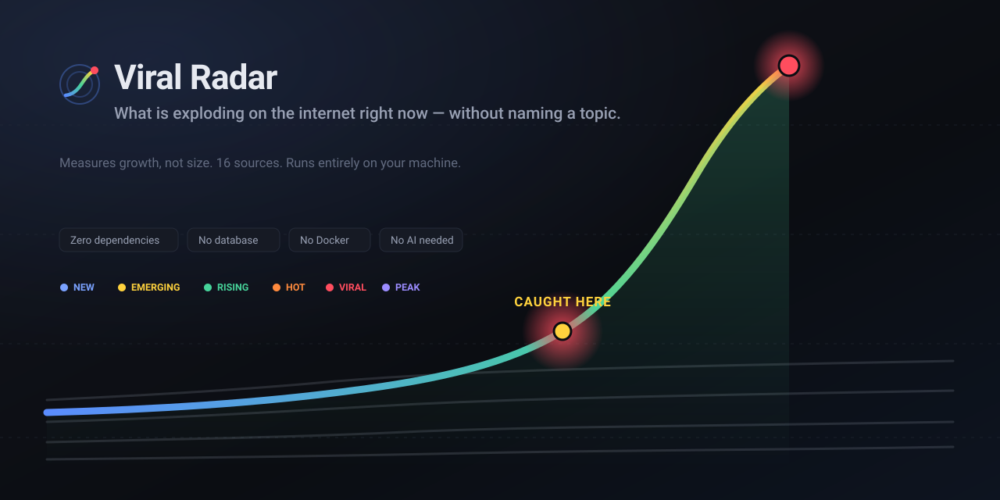

<p align="center">
  
</p>

<p align="center">
  <a href="#quick-start"><b>Quick start</b></a> ·
  <a href="#what-it-measures">What it measures</a> ·
  <a href="#sources">Sources</a> ·
  <a href="#configuration">Configuration</a> ·
  <a href="docs/">Docs</a> ·
  <a href="#راهاندازی-سریع-فارسی">فارسی</a>
</p>

---

# Viral Radar

A local program that answers one question, without you typing a topic:

> **What is exploding on the internet right now — and what should I make today?**

It watches public sources, measures how fast each post is growing, compares that
growth with what is *normal for that platform and that creator*, groups the same
story across platforms, and ranks what it finds.

No topic input. No AI required. No account anywhere. Nothing leaves your machine.

## Quick start

```bash
npm install            # dev tooling only — the backend has zero runtime dependencies
cp .env.example .env
npm run build          # builds the dashboard once
npm start              # http://127.0.0.1:7788
```

Needs **Node.js 24 or newer** and nothing else — no database server, no Docker,
no cloud account. On Windows, `scripts\install.ps1` does all of the above and
puts a shortcut on your desktop.

Five sources start working immediately with no configuration at all. The rest
each need a free key, and the **Settings** page walks you through them.

> **Give it two collection cycles — about 40 minutes — before judging the
> results.** Growth cannot be measured from a single observation, so the first
> pass is only a snapshot. This is not a bug; it is what the whole thing is
> about.

## What it measures

The unit of analysis is **a piece of content and how its numbers move over
time** — never a predefined topic.

| Signal | What it answers | Weight |
| --- | --- | --- |
| **Velocity** | how fast is it gaining, per hour | 30% |
| **Acceleration** | is the growth itself speeding up | 30% |
| **Anomaly** | how far above this creator's own normal is it | 15% |
| **Engagement** | interactions per unit of reach | 10% |
| **Cross-source** | do independent platforms carry the same story | 10% |
| **Freshness** | time decay | 5% |

Raw numbers are never compared across platforms. Each value is first ranked
against **that platform's own recent distribution**, per hour of day, so a
Reddit upvote and a YouTube view can end up in the same list honestly.

Every item carries a **score** (0–100, how remarkable) and a separate
**confidence** (0–1, how much evidence backs it). A 40M-view video seen once has
a high score and low confidence — and the dashboard says so.

**Lifecycle:** `NEW → EMERGING → RISING → HOT → VIRAL → PEAK → DECLINING → DEAD`.
`EMERGING` deliberately means *small but exploding* — the 1,200-follower account
at hour two, not the thing everyone already saw yesterday.

<details>
<summary><b>Worked example: why 60 points can outrank 326</b></summary>

Two Hacker News posts, real numbers from a running instance:

| | Harness Engineering | Queryable Executables |
| --- | --- | --- |
| Points | 60 | **326** |
| **Growth** | **69.6 points/hour** | 3.8 points/hour |
| Acceleration | 70.0 | 3.1 |
| Age | 1.2 hours | 38.8 hours |
| Freshness | 0.90 | 0.03 |
| Growth rank on the platform | 97th percentile | 76th |
| **Score** | **65.9** | 59.8 |

The second has five times the points and loses, because sixty percent of the
weight is on growth rather than size. The first is exploding *now*; the second
already happened.

</details>

## Sources

Sixteen adapters. Eleven need nothing but the program itself.

**Working with no configuration**

| Source | Gives | Real metric |
| --- | --- | --- |
| **Google Trends** | search topics per country | approximate traffic band |
| **Google News** | 8 topic sections × your language and country | — |
| **Wikipedia** | most-read articles per language | **daily pageviews** |
| **Hacker News** | stories, `top` and `new` | points, comments |
| **RSS / Atom** | any feed you list | — |
| **Mastodon** | posts, hashtags and shared links | favourites, boosts, replies |
| **Bluesky** | public feeds | likes, reposts, replies, quotes |
| **GitHub** | recently created repositories | stars, forks |
| **Charts** | Steam, Apple, Spotify | rank movement, concurrent players |
| **Telegram** | public channel previews | **views per post** |

**One free key each** — the Settings page links to every one

| Source | Gives | Why it matters |
| --- | --- | --- |
| **YouTube** | trending charts and open search | **real view counts** — the most valuable source here |
| **Reddit** | `r/all/rising`, `r/popular` | upvotes, comments, crossposts |
| **Imgur** | the gallery: `viral` and `rising` | **views per post** — the purest virality signal |
| **Twitch** | live streams | **people watching right now** |
| **TMDB** | film and television | a popularity figure that moves daily |
| **Product Hunt** | product launches | votes, comments |
| **Giphy** | trending GIFs and stickers | rank only |

**Registered but unavailable:** TikTok, X and Instagram appear in the dashboard
with the exact reason they cannot run and the exact step that would change it.
They return no data rather than fake data. See [docs/sources.md](docs/sources.md).

## The dashboard

Vue 3, TypeScript and Vuetify, in **English, Persian and Arabic** with full
right-to-left support. Built once and served by the same process as the API —
one port, no second server.

| Page | What it is for |
| --- | --- |
| **Dashboard** | viral now, breaking out, emerging, rising, cross-platform topics |
| **Today's brief** | *what to make today*, filtered to your language, country and platform threshold |
| **All trends** | every item, with filters that apply after detection |
| **Topics** | stories grouped across platforms |
| **Creators** | breakouts and a leaderboard measured against each account's own history |
| **Reports** | scatter, heatmap, timeline, distributions, per-source quality |
| **Sources** | what each plugin can do, its health, and what it needs |
| **System** | jobs, events, network state, manual interventions |
| **Settings** | writes `.env`, with a first-run wizard |

Charts are hand-built SVG rather than a library: they inherit the theme, mirror
correctly in right-to-left, animate on data change, and cost a few kilobytes.

## Commands

```bash
npm start                          # dashboard + background scheduler
npm run build                      # rebuild the dashboard after changing web/
npm test                           # 123 tests
npm run typecheck

node apps/api/src/main.ts collect            # one discovery pass, all sources
node apps/api/src/main.ts collect youtube    # just one
node apps/api/src/main.ts refresh HOT        # re-measure the fast movers
node apps/api/src/main.ts analyze            # recompute scores, topics, baselines
node apps/api/src/main.ts top 20             # leaderboard in the terminal
node apps/api/src/main.ts sources            # what is configured and what is not
node apps/api/src/main.ts doctor             # config + database + connectivity
node apps/api/src/main.ts reclassify         # re-run language detection over stored items
node apps/api/src/main.ts cleanup            # apply the retention policy now
```

## Configuration

Everything lives in `.env`, and everything worth changing is editable from the
**Settings** page. See [.env.example](.env.example) for the annotated list.

```bash
REGIONS=IR,US          # countries Google Trends, Google News and YouTube are asked about
LANGUAGES=fa,en        # a preference, not a rule — any page filter overrides it
YOUTUBE_API_KEY=       # unlocks real view counts
HOT_REFRESH_MIN=5      # how often fast movers are re-measured
MAX_AGE_HOURS=72       # anything older stops counting as "now"
NETWORK_MODE=DIRECT    # or HTTP_PROXY with PROXY_URL
AI_PROVIDER=           # empty = AI_DISABLED, which is fully supported
```

Filters — language, country, platform, type, lifecycle state, minimum score,
creator, hashtag, free text — are applied **after** detection, never before.

## Project layout

```text
viral-radar/
├── apps/
│   ├── api/            backend: pipeline, trend engine, HTTP API
│   │   ├── src/core/       the domain — pure, no I/O, no framework
│   │   ├── src/sources/    one file per platform adapter
│   │   ├── src/pipeline/   collect · analyze · schedule
│   │   ├── src/db/         every SQL statement, plus migrations
│   │   └── tests/          123 tests
│   └── web/            Vue 3 dashboard, built into web/dist
├── docs/               architecture, scoring, sources, security, decisions
├── scripts/            installers and launchers
└── data/               the SQLite file (git-ignored)
```

## Documentation

| | |
| --- | --- |
| [architecture.md](docs/architecture.md) | layers, module boundaries, data flow |
| [trend-engine.md](docs/trend-engine.md) | the scoring model, in detail |
| [sources.md](docs/sources.md) | every adapter and the plugin contract |
| [database.md](docs/database.md) | schema and query patterns |
| [security.md](docs/security.md) | threat model and controls |
| [operations.md](docs/operations.md) | running it, tuning it, fixing it |
| [decisions.md](docs/decisions.md) | why the stack is what it is |
| [limitations.md](docs/limitations.md) | what this cannot do, and why |

## What this is not

It is not a hyperscale system and does not pretend to be one. It is a
single-process program that comfortably handles a serious personal research
workload on one machine.

It also does not bypass anything: no CAPTCHA solving, no rate-limit evasion, no
authentication bypass, no IP rotation. A 429 is obeyed. A challenge page becomes
a **manual intervention** card that asks *you* to decide.

---

<div dir="rtl">

## راه‌اندازی سریع (فارسی)

این برنامه فقط روی کامپیوتر خودت اجرا می‌شود. نه سرور می‌خواهد، نه داکر، نه دیتابیس جدا.

```bash
npm install
cp .env.example .env
npm run build
npm start              # داشبورد: http://127.0.0.1:7788
```

روی ویندوز، `scripts\install.ps1` همهٔ این‌ها را انجام می‌دهد و یک شورتکات روی دسکتاپ می‌گذارد.

**پنج منبع بدون هیچ تنظیمی فوراً کار می‌کنند.** برای دیدن ویدیوهایی که واقعاً
بازدید می‌گیرند، یک کلید رایگان یوتیوب بگیر (دو دقیقه) و در صفحهٔ **تنظیمات**
واردش کن — همان‌جا لینک گرفتن هر کلید هست.

```bash
REGIONS=IR,US          # کشورهایی که برایشان محتوا می‌سازی
LANGUAGES=fa,en        # فقط یک ترجیح؛ فیلتر هر صفحه بر آن غلبه می‌کند
```

### نکتهٔ مهم

سیستم برای محاسبهٔ **سرعت رشد** به حداقل دو اندازه‌گیری نیاز دارد. بعد از اجرا
حدود ۴۰ دقیقه صبر کن تا ستون‌های «وایرال» و «در حال ظهور» پر شوند. اجرای اول
فقط یک عکس لحظه‌ای است.

### بهترین بخش برای کار تو

صفحهٔ **«امروز چه بسازیم»**: موضوع‌هایی که همزمان در چند پلتفرم بالا آمده‌اند،
با فیلتر زبان و کشور. کنار هر گزینهٔ «تعداد پلتفرم» نوشته چند موضوع در آن حالت
وجود دارد، تا اگر فیلتری خالی برگشت بدانی چرا.

اگر یک ماجرا همزمان در تلگرام، یوتیوب و خبرگزاری‌ها باشد، یعنی همان روز ارزش
ساختن دارد.

### رابط کاربری

کامل به سه زبان **فارسی، انگلیسی و عربی** با پشتیبانی راست‌به‌چپ. هر عددی که
می‌بینی برچسب صریح دارد و با نگه‌داشتن ماوس توضیحش را می‌گوید.

</div>
